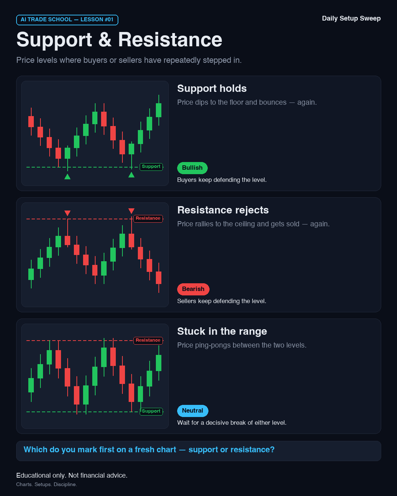
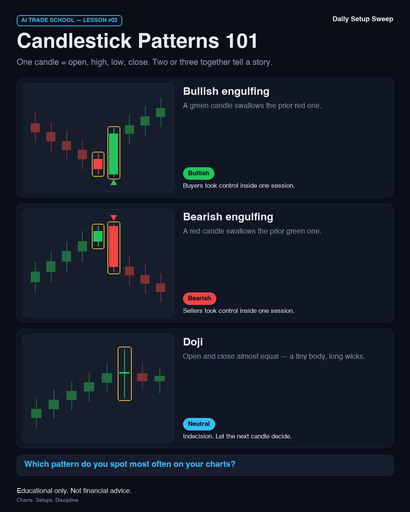

# AI Trade School — reformatted back catalogue

Lessons published before the AI Trade School format existed, re-rendered on it.
The live posts on X still show the original text and card — X has no edit path here —
so this directory is the on-brand copy: use it if a lesson is ever re-posted, and as the
reference for what `tv social educate` now produces.

| Lesson | Topic | Published | Live post |
| --- | --- | --- | --- |
| #01 | Support & Resistance | 2026-09-07 | https://x.com/DailySetupSweep/status/2097021180506964459 |
| #02 | Candlestick Patterns 101 | 2026-09-08 | https://x.com/DailySetupSweep/status/2097345042511761894 |

## Lesson #01 — Support & Resistance



```
🎓 AI Trade School — Lesson #01
Support & Resistance
Price levels where buyers or sellers have repeatedly stepped in.
Support = a floor where buyers have shown up before.
Resistance = a ceiling where sellers have shown up before.
✅ Bullish — Support holds: buyers keep defending the level.
🛑 Bearish — Resistance rejects: sellers keep defending the level.
⚖️ Neutral — Stuck in the range: wait for a decisive break of either level.
👇 Which do you mark first on a fresh chart — support or resistance?
#TechnicalAnalysis #TradingEducation
```

Alt text: AI Trade School Lesson #01: Support & Resistance. Price levels where buyers or sellers have repeatedly stepped in. Support holds (Bullish): Price dips to the floor and bounces — again. Buyers keep defending the level. Resistance rejects (Bearish): Price rallies to the ceiling and gets sold — again. Sellers keep defending the level. Stuck in the range (Neutral): Price ping-pongs between the two levels. Wait for a decisive break of either level. Educational only. Not financial advice.

## Lesson #02 — Candlestick Patterns 101



```
🎓 AI Trade School — Lesson #02
Candlestick Patterns 101
One candle = open, high, low, close. Two or three together tell a story.
Green body: closed above the open. Red body: closed below.
Wicks show where price went but could not stay.
✅ Bullish — Bullish engulfing: buyers took control inside one session.
🛑 Bearish — Bearish engulfing: sellers took control inside one session.
⚖️ Neutral — Doji: indecision. Let the next candle decide.
👇 Which pattern do you spot most often on your charts?
#TechnicalAnalysis #TradingEducation
```

Alt text: AI Trade School Lesson #02: Candlestick Patterns 101. One candle = open, high, low, close. Two or three together tell a story. Bullish engulfing (Bullish): A green candle swallows the prior red one. Buyers took control inside one session. Bearish engulfing (Bearish): A red candle swallows the prior green one. Sellers took control inside one session. Doji (Neutral): Open and close almost equal — a tiny body, long wicks. Indecision. Let the next candle decide. Educational only. Not financial advice.
